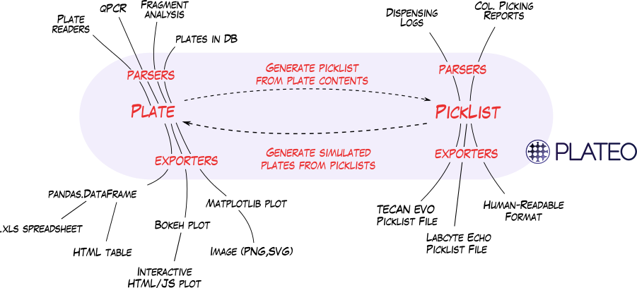

Plateo Documentation
==========================

Plateo (pronounced Plato, like the Planet) is a Python library to assist in the
planning, running and checking of laboratory experiments involving microplates.

It can be used to:

- Read and write robotic protocols (picklists) in different formats to accomodate different liquid dispensers (Tecan EVO, Labcyte Echo).
- Simulate liquid dispensing runs, taking into account the capacity and dead volume of each container, to predict the maps of future plates.
- Parse plate data from common laboratory robots (for kinetic experiments, fragment analysis, qPCR, etc.)
- Export plate information in various formats (graphics, spreadsheets, HTML, JSON, etc.).

The following schema shows how Plateo's file parsers, exporters, and protocol simulator work together

Installation
-------------

You can install Plateo through PIP

.. code:: shell

    sudo pip install bandwitch

Alternatively, you can unzip the sources in a folder and type

.. code:: shell

    sudo python setup.py install

Example
-------

Say you have an ``assembly_plate``

Contribute
----------

Plateo is an open-source library originally written at the
Edinburgh Genome Foundry by Zulko_. It is released on Github_ under the MIT
licence (¢ Edinburgh Genome Foundry), everyone is welcome to contribute.

.. raw:: html

       <a href="https://twitter.com/share" class="twitter-share-button"
       data-text="Plateo - Digestion enzyme selection with Python" data-size="large" data-hashtags="Bioprinting">Tweet
       </a>
       
       <iframe src="http://ghbtns.com/github-btn.html?user=Edinburgh-Genome-Foundry&repo=bandwitch&type=watch&count=true&size=large"
       allowtransparency="true" frameborder="0" scrolling="0" width="152px" height="30px" margin-bottom="30px"></iframe>

.. toctree::
    :hidden:
    :maxdepth: 3

    self

.. toctree::
    :hidden:
    :caption: Reference
    :maxdepth: 3

    ref

.. _Zulko: https://github.com/Zulko/
.. _Github: https://github.com/EdinburghGenomeFoundry/bandwitch
.. _PYPI: https://pypi.python.org/pypi/bandwitch
